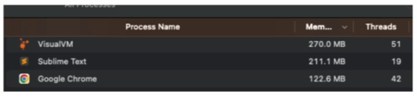
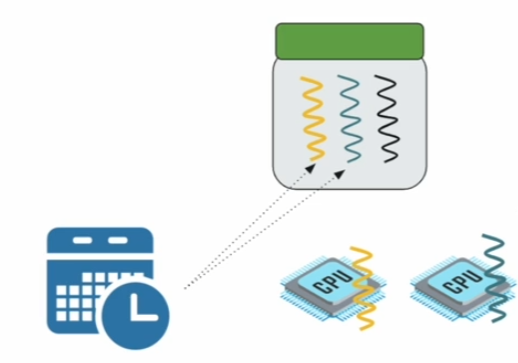
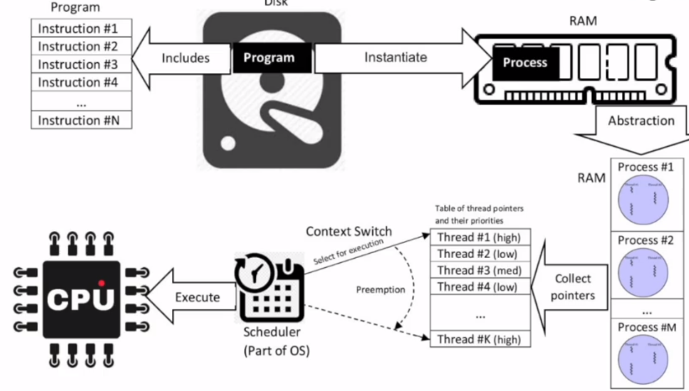
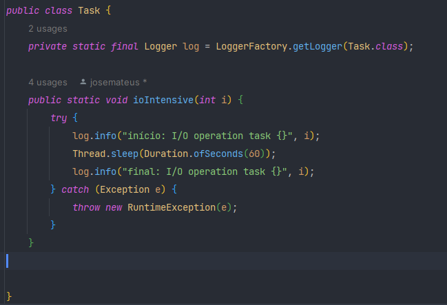
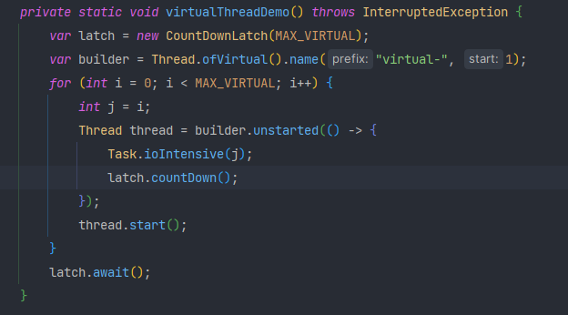
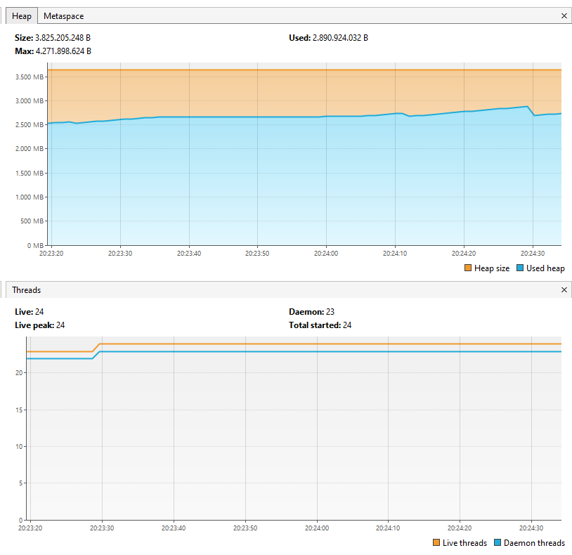

# Virtual threads no Java 21

Imagine que você fez uma aplicação java simples que gerou um arquivo JAR, este arquivo JAR estará em algum local no seu disco.

Quando rodamos o ```java -jar app.jar ``` 
teremos um processo criado na memória RAM que tem instruções a serem executadas pela CPU.
- Processo (unidade de recursos): instância de um programa de computador. 
Inclui código, recursos alocados,etc; tem um custo computacional elevado (criação/destruição).
- Thread (unidade de execução): parte de um processo, podemos ter várias threads ligadas a um processo. 
As threads podem compartilhar a memória do processo. 
Veja a imagem:
 
O processo Google Chrome está com 42 threads abertas. Algo importante para enterdermos no exemplo abaixo é que tempos 1 processo, 3 threads, 2 CPUs,
o scheduler (agendador de tarefas) define por quanto tempo cada thread irá executar. No caso da imagem podemos rodar em paralelo duas tarefas por vez (duas threads por vez). A troca de execução de threads é conhecida como context switch.

Fluxo:

Uma thread criada no Java (platform thread) é um wraper 1:1 para uma thread do sistema operacional, o que torna o trabalho com threads em Java muito custoso.
Veja o código abaixo:
``` 
void metodo1() {
    int a = 5;
    metodo2();
    ...
}

void metodo2() {
    int b = 25;
    metodo3();
    ...
}

void metodo3() {
    ...
}
```
as variáveis locais e chamadas de função são armazenadas em algum local, no caso será na Stack.
cada thread cria tem sua própria stack, o tamanho no caso normalmente é dado em MB e depende da arquitetura do processador. 
É determinado quando o processo inicia ou quando a thread é criada. (tamanhos comuns: 1MB, 2MB)
Heap: armazena os objetos criados dinamicamente => arraylist, hashmap, objetos
Stack: variaveis locais, referencias, chamadas de função.

Bem, mas qual é o problema disso? 
1 - Custo computacional relativamente alto;
2 - Ociosidade das threads que estão travadas em operações de I/O (acontece com frequência em microservices).

é aí que entra a ideia de Virtual Threads.


Virtual Threads são daemons por default. Podemos esperar usando o latch.await() para aguardar várias threads. Vemos fazer um exemplo com virtual threads, considere a task abaixo que demora 60 segundos para executar:

Podemos executar essa tarefa repassando-a para uma Thread, nesse caso para uma virtual thread:

configurei o MAX_VIRTUAL para 1_000_000 (1 milhão de tasks rodando :zany_face:)

Veja o gráfico: 

